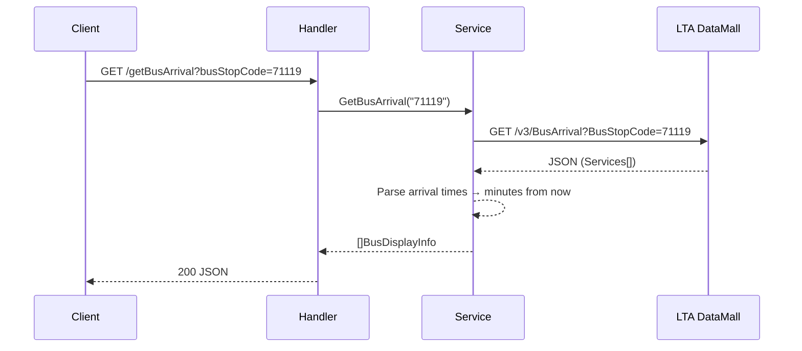
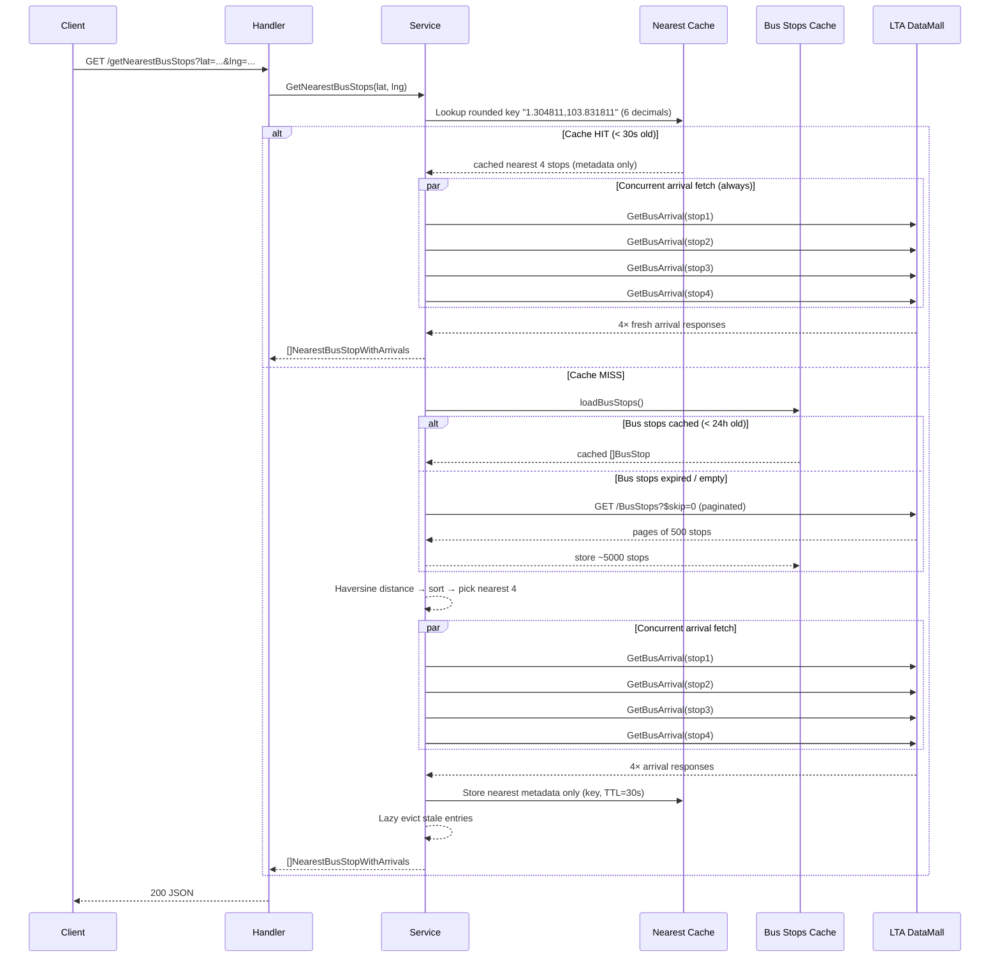

# when-bus Architecture

## System Overview

when-bus is a Go HTTP server that proxies the Singapore LTA DataMall API to provide bus arrival information. It exposes two main endpoints and serves an HTMX-based UI.

```
┌────────────────────────────────────────────────────────────────────────┐
│                           when-bus server                             │
│                                                                       │
│  ┌──────────┐    ┌────────────┐    ┌───────────┐    ┌──────────────┐  │
│  │  net/http │───▶│  handlers  │───▶│  service  │───▶│  LTA DataMall│  │
│  │  (mux)   │    │  (api.go)  │    │           │    │  (external)  │  │
│  └──────────┘    └────────────┘    └───────────┘    └──────────────┘  │
│       │                                  │                            │
│       │          ┌────────────┐    ┌─────┴──────┐                     │
│       └─────────▶│  templates │    │   caches   │                     │
│                  │  (HTMX UI) │    │ (in-memory)│                     │
│                  └────────────┘    └────────────┘                     │
└────────────────────────────────────────────────────────────────────────┘
```

## Project Structure

```
when-bus/
├── cmd/server/main.go          # Entry point, wires mux → handlers → service
├── openapi.yaml                # API contract (source of truth)
├── internal/
│   ├── generated/api.gen.go    # oapi-codegen output (do not edit)
│   ├── handlers/api.go         # HTTP handler layer (request/response mapping)
│   ├── services/service.go     # Business logic, LTA client, caching
│   ├── logging/logging.go      # Structured JSON logger (slog)
│   └── repository/db.go        # Stub persistence layer (unused)
├── templates/                  # HTMX HTML pages
├── static/                     # CSS / Tailwind assets
└── design/                     # This folder
```

## API Endpoints

| Endpoint | Method | Params | Description |
|---|---|---|---|
| `/getBusArrival` | GET | `busStopCode` (required) | Live arrivals for one bus stop |
| `/getNearestBusStops` | GET | `lat`, `lng` (required) | Nearest 4 bus stops with arrivals |
| `/api` | GET | `name` (optional) | Demo endpoint |

---

## Request Flow

### `GET /getBusArrival?busStopCode=71119`

Straightforward proxy to LTA with response transformation.



### `GET /getNearestBusStops?lat=1.3048&lng=103.8318`

Multi-step flow with two cache layers and concurrent fetching.



---

## Caching Design

Two independent in-memory caches live on the `service` struct. No external dependencies (Redis, etc.) are needed — the data volume is small and a single-process model is sufficient.

### Layer 1: Bus Stops Cache

Bus stop locations are static infrastructure that rarely change.

| Property | Value |
|---|---|
| **What** | Full list of all Singapore bus stops (~5000 entries) |
| **TTL** | 24 hours |
| **Key** | N/A (single global list) |
| **Eviction** | Replaced on next load after TTL expiry |
| **Concurrency** | `sync.RWMutex` with double-checked locking |
| **Fallback** | If refresh fails but stale data exists, returns stale data |

```
                    ┌──────────────────────┐
  loadBusStops()    │   busStopsMu (RWMux) │
  ─────────────────▶│                      │
                    │  RLock: check TTL    │
                    │    ├─ valid → return  │
                    │    └─ expired ──┐     │
                    │                 ▼     │
                    │  Lock: double-check   │
                    │    ├─ valid → return  │
                    │    └─ fetch from LTA  │
                    │       ├─ ok → update  │
                    │       └─ err → stale  │
                    └──────────────────────┘
```

**Why double-checked locking?** Multiple goroutines may see an expired cache simultaneously. Without the second check inside the write lock, several would redundantly fetch from LTA.

### Layer 2: Nearest Stops Metadata Cache

Skips recomputing Haversine over ~5000 stops for the same (rounded) location. **Arrival times are not cached** — every request issues 4 fresh `BusArrival` calls so `NextBuses` match LTA in real time.

| Property | Value |
|---|---|
| **What** | Nearest 4 stops: codes, road, description, distance (no `Arrivals`) |
| **TTL** | 30 seconds |
| **Key** | 6 decimal places of lat/lng (~0.1 m; metadata cache only) |
| **Eviction** | Lazy — stale entries (> 2× TTL) purged on each cache write |
| **Concurrency** | `sync.RWMutex` |
| **Storage** | A compact copy of 4 `busStopDistance` rows (does not retain the full distance slice) |

```
  nearestCacheKey(1.304811111, 103.831811111)  →  "1.304811,103.831811"
  nearestCacheKey(1.304811114, 103.831811114)  →  "1.304811,103.831811"   ← same bucket
  nearestCacheKey(1.305000, 103.832000)        →  "1.305000,103.832000"   ← different
```

The HTTP API binds lat/lng as `float64` (OpenAPI `format: double`). Haversine uses the full request values. Only the metadata cache buckets keys at 6 decimals (~0.1 m); arrivals still refresh every request.

### Cache Interaction Diagram

```
  Request: GetNearestBusStops(lat, lng)
                │
                ▼
    ┌───────────────────┐
    │ Nearest Cache     │──── HIT ───▶ 4× BusArrival (fresh NextBuses)
    │ (metadata, 30s)  │
    └───────┬───────────┘
            │ MISS
            ▼
    ┌───────────────────┐
    │ Bus Stops Cache   │──── HIT ───▶ use cached stops
    │ (24h TTL)         │
    └───────┬───────────┘
            │ MISS
            ▼
    ┌───────────────────┐
    │ LTA /BusStops     │ paginated fetch
    │ (500/page)        │ store in bus stops cache
    └───────┬───────────┘
            │
            ▼
    ┌───────────────────┐
    │ Haversine sort    │ compute distances, pick nearest 4
    └───────┬───────────┘
            │
            ▼
    ┌───────────────────┐
    │ LTA /BusArrival   │ 4× concurrent goroutines
    │ (×4 parallel)     │ errors → empty arrivals (graceful)
    └───────┬───────────┘
            │
            ▼
    ┌───────────────────┐
    │ Store metadata in │ + lazy evict stale entries
    │ nearest cache     │
    └───────────────────┘
```

---

## Concurrency Model

### Goroutine Usage

The service spawns goroutines in exactly one place: fetching bus arrivals for the 4 nearest stops in `GetNearestBusStops`. Each call creates 4 short-lived goroutines bounded by a `sync.WaitGroup`.

```go
result := make([]NearestBusStopWithArrivals, count)  // pre-allocated, no shared writes
var wg sync.WaitGroup
for i, stop := range nearest {
    wg.Add(1)
    go func(idx int, d busStopDistance) {     // idx → dedicated slot
        defer wg.Done()
        arrivals, _ := s.GetBusArrival(d.BusStopCode)
        result[idx] = ...                     // write to own index only
    }(i, stop)
}
wg.Wait()  // blocks until all 4 complete
```

**Safety properties:**
- Each goroutine writes to its own index in a pre-allocated slice — no data races.
- `wg.Wait()` ensures all goroutines complete before the function returns — no leaks.
- `http.Client` is safe for concurrent use and reused across goroutines.
- Arrival errors are swallowed per-stop (empty `[]BusDisplayInfo`), so one slow/failing stop doesn't block the others.

### Lock Ordering

There are two independent mutexes. They are never held simultaneously, so deadlock is impossible.

| Mutex | Protects | Held During |
|---|---|---|
| `busStopsMu` | `busStops`, `busStopsTime` | `loadBusStops()` |
| `nearestMu` | `nearestCache` | cache read/write in `GetNearestBusStops()` |

### Shared `http.Client`

A single `http.Client` with a 10-second timeout is created at service initialization and shared across all requests. Go's `http.Client` and its default transport are safe for concurrent use and pool TCP connections automatically.

---

## Data Flow: LTA API Integration

### Bus Arrival (`/v3/BusArrival`)

```
LTA Response                              Internal Model
─────────────                             ──────────────
{                                         BusDisplayInfo {
  "ServiceNo": "36",          ──────▶       ServiceNo:    "36"
  "Operator": "SBST",         ──────▶       Operator:     "SBST"
  "NextBus": {                              NextBuses:    ["3", "8", "15"]
    "EstimatedArrival": "...", ──┐           LoadStatus:   ["SEA", "SDA", "LSD"]
    "Load": "SEA",              ├──▶        IsWheelchair: true
    "Feature": "WAB"            │
  },                            │
  "NextBus2": { ... },    ─────┤     time.Parse(RFC3339) →
  "NextBus3": { ... }     ─────┘     time.Until().Minutes() → "3"
}
```

### Bus Stops (`/BusStops`)

Paginated OData endpoint. Each page returns up to 500 stops. A short final page signals completion.

```
Page 1: GET /BusStops?$skip=0    → 500 stops
Page 2: GET /BusStops?$skip=500  → 500 stops
...
Page N: GET /BusStops?$skip=X    → <500 stops (done)
```

### Nearest Stop Selection

```
All ~5000 stops
      │
      ▼
  Haversine distance from (lat, lng) to each stop
      │
      ▼
  Sort ascending by distance
      │
      ▼
  Take first 4
```

The Haversine formula computes great-circle distance on a sphere, accurate enough for the ~1km distances involved in finding nearby bus stops.

---

## Error Handling Strategy

| Scenario | Behavior |
|---|---|
| LTA `/BusArrival` returns non-200 | Error propagated to client as 500 |
| LTA `/BusArrival` fails for one stop in nearest-4 | That stop gets `Arrivals: []`, others unaffected |
| LTA `/BusStops` fails, cache is populated | Stale cached data is returned with a warning log |
| LTA `/BusStops` fails, cache is empty | Error propagated to client as 500 |
| JSON parse error | Error propagated to client as 500 with body prefix in log |
| Invalid query params | 400 from oapi-codegen validation layer |

---

## Key Design Decisions

| Decision | Rationale |
|---|---|
| In-memory cache over Redis | Single-process deployment, data fits in RAM (~5000 stops ≈ few hundred KB), no infra dependency |
| 24h TTL for bus stops | Bus stops are physical infrastructure; the LTA list changes infrequently |
| 30s TTL for nearest **metadata** | Avoids rescanning all stops for repeated pings; arrivals are always refetched for realtime NextBuses |
| 6-decimal cache key (~0.1 m) | Reduces redundant stop-list work; full `float64` used for distance |
| Concurrent arrival fetch | 4× independent HTTP calls; concurrency cuts wall-clock time from ~4s to ~1s |
| Double-checked locking for bus stops | Prevents thundering-herd on cache miss — only one goroutine fetches |
| Lazy eviction over background goroutine | Simpler, no long-running goroutine to manage; cache is small |
| Stale data fallback | Availability over consistency — better to show slightly old stops than fail |
| Configurable base URLs on service struct | Enables `httptest.Server` injection for unit tests without interfaces/mocks |
